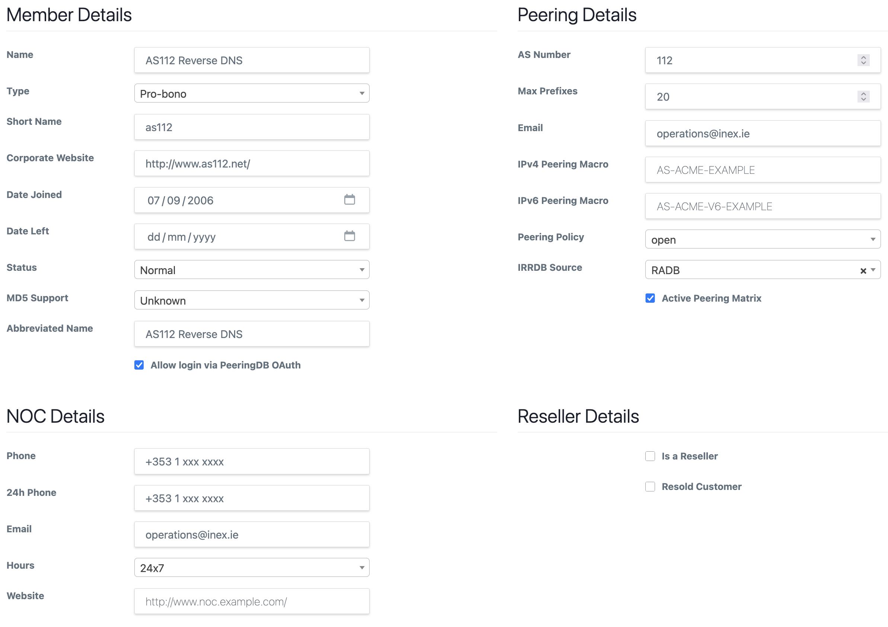

# AS112 Service

> **Prerequisite Reading:** Ensure you first familiarize yourself with [the generic documentation on managing and generating router configurations here](routers.md).

**AS112** is a service which provides anycast reverse DNS lookup for several prefixes, namely:

* 10.0.0.0/8
* 192.168.0.0/16
* 172.16.0.0/12
* 169.254.0.0/16

Because these IP addresses are widely used for private networking, many end-user systems are configured to perform reverse DNS lookups for these address ranges.  DNS lookups for these ranges should always be null-answered quickly, in order to make sure that DNS retransmits don’t occur (thereby overloading local DNS resolvers), and to prevent end-user systems from hanging due to DNS lookups.

AS112 services are provided around the world by a group of volunteers and, very often, by IXP operators for the benefit of their members.

[INEX](https://www.inex.ie/) has always provided an AS112 service to our members on all peering LANs and so it is an integral part of **IXP Manager**. You can read all about INEX's implementation at https://www.inex.ie/technical/as112-service/ including graphs for the service. Feel free to use our test and examples from that page for your own IXP.

## Building an AS112 Service

You can find instructions for building an AS112 service in [rfc7534](https://tools.ietf.org/html/rfc7534). You should also add AS112 redirection using DNAME functionality as per [rfc7535](https://tools.ietf.org/html/rfc7535).

You will also find a lot more information and how-tos on the official website at: [https://www.as112.net/](https://www.as112.net/).

Follow these instructions in every way to build the AS112 service on a (virtual) machine with an appropriate DNS server - **except skip the installation and configuration of the BGP daemon**. When using IXP Manager, you will need to use Bird for this and IXP Manager will create the configuration.

## Managing Your AS112 Service from IXP Manager

AS112 is disabled by default in IXP Manager. This really just means UI elements are hidden. To enable these, set the following in your `.env` file:

```
IXP_AS112_UI_ACTIVE=true
```

This will add UI elements including:

* an *AS112 Client* checkbox on VLAN interface forms. Checking this toggles a database field to indicate if the customer's VLAN interface should have the AS112 service enabled.
* an indication as to whether the user has AS112 services enabled on various overview screens.

Enabling the AS112 service simply indicates if a BGP peering session should be created in the AS112 BGP configuration when downloading the AS112 router's BGP configuration from IXP Manager.

### Creating the Pro-Bono AS112 Customer

You need to add the AS112 service as a pro-bono member of your IXP in IXP Manager. Here's INEX's example:



You then need to create an interface for the AS112 service on each peering LAN where the service will be offered. Here again is INEX's example from our peering LAN1 in Dublin:


Note that historically INEX has not used MD5 on our AS112 service. This is because the service dates from over 20 years ago at INEX when MD5 support was not available. There is no reason not to use MD5 on the service if you wish.

### Generating the Bird Configuration

Please see the [router configuration generation](routers.md) for this.

For your AS112 server, we have a [sample script(s)](https://github.com/inex/IXP-Manager/tree/main/tools/runtime/as112) for pulling and updating the configuration from IXP Manager. We typically put this in an hourly cron.

## Other Notes

At INEX, we typically have our AS112 service peer with our route servers.

This will happen automatically if you check the *Route Server Client* on the AS112 VLAN interface configuration (see above screen shot) and also check the *AS112 Client* checkbox on the VLAN interfaces of your route servers in IXP Manager. *Note that in the same way as you create an AS112 __pro-bono__ customer, you should also have a dedicated route server __internal__ customer.*
