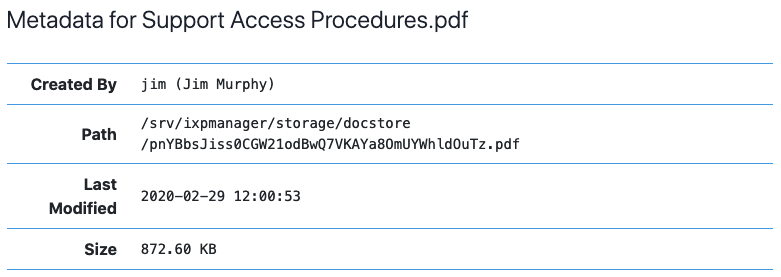

# Document Store

???+ note "**This page refers to features introduced in IXP Manager v5.4 (general document store) and v5.6 (per-member document store).**"

**IXP Manager** has two *document stores* which allow administrators to upload and manage document. The two types are:

1. a *general* document store which allows administrators to make documents generally available for specific [user classes](../usage/users.md#types-of-users) (public, customer user, customer admin, superadmin). Example use cases for this are member upgrade forms, distribution of board or management minutes, etc.
2. A per-member document store which allows administrators to upload documents on a per-member basis. These can be made visible to administrators only or also to users assigned to that specific member. Example use cases for this are member application forms / contracts, completed / signed port upgrade forms, etc.

Both document stores support:

1. Upload any file type.
2. Edit uploaded files including name, description, minimum access privilege and replacing the file itself.
3. Display of text (`.txt`) and display and parsing of Markdown (`.md`) files within IXP Manager.
4. Directory hierarchy allowing the categorisation of files.
5. Each directory can have explanatory text.
6. Deletion of files and recursive deletion of directories.
7. Logging of destructive actions.

Also for the general document store, and non-public documents within it, logging and reporting of downloads (total downloads and unique user downloads).

Please note that all actions except for viewing and downloading files are restricted to super users.

The general directory store is accessible:

* for super admins: via the *Directory Store* left-hand menu option under *IXP ADMIN ACTIONS*.
* for all users, via the *Directory Store* menu item in the *Customer / Member Information* menu at the top of the page.

The per-member directory store is accessible:

* for super admins: under the *Directory Store* left-hand menu option in the *IXP ADMIN ACTIONS* section. **This is particularly useful as only members with documents will be listed.**
* for all users, via the *Documents* tab in the member's own portal or the administrators customer overview page. The latter is where administrators would add files or directories for the first time.

In the following sections, we use screenshots from the general document store but will highlight and specific differences for the per-member document store.


## Directories

Directories are database entries to which uploaded files are attached (rather than actual directories on the storage media).

Directories can be created via the *Create Directory* button on the top right of the document store. See the following image showing the *Create Directory* form. As usual, contextual help is available via the green *Help* button.


Note that you do not need to set any permissions on directories - directories (and directory hierarchy) will only be visible to each user class if they contain files that the specific user class should be able to see.

If you enter a description, you will see a *gray section* at the top of the directory listing as shown in the following image. The text you enter will be parsed as Markdown and displayed as HTML. If you leave the description blank, no such section will be shown. This is a useful feature to provide context to your users about the documents in a given directory.


When viewing directories in a directory listing, a per-directory context menu is available per the following image and with the following two options:


1. **Edit:** allows you to edit a directory's name, location (parent directory) and / or the description.
2. **Delete:** this removes the directory and **recursively deletes all files and folders within that directory**.

## Files

Files can be uploaded via the *Upload File* button on the top right of the document store. See the following image showing the *Upload File* form with the contextual help shown (via the green *Help* button).


The various fields are well explained by the contextual help above and we will add some additional emphasis here:

* You should use an appropriate name with file extension as the download file will be given this as its filename.
* Minimum privilege is just that - **minimum**. If a document is set for public access then **anyone can download it**. If it is set to *Customer User* then one **must** be logged into IXP Manager to see the file in directory listings and to view / download it. If it is set to *Customer User* then *Customer Admins* and *Super Users* will of course also be able to view it.

**NB:** for the per-member document store, there is no option to make a file Publicly available.

The following is how a file appears in a directory listing:


*CUSTUSER* indicates the minimum access permissions for the file. The numbers *19 (10)* tell super admins that there have been a total of 19 downloads and 10 of those were unique to individual users in IXP Manager (i.e. some users would have downloaded this file two or more times). Note that **only downloads by logged in users are counted**. Publicly accessible files downloaded by non-logged in users are not recorded (if you must know this then that information is available from your web server log files). The date, *Feb 29, 2020* is the date the file itself (not metadata) was last changed via the *Edit* option.

**NB:** there is no logging of files downloaded in the per-member document store. Please see below for more information.

The options in the per-file context menu are:

* **Metadata:** shows information such as file size and location on the storage media in a pop-up dialog such as the following:

  

* **Show SHA256:** show the file's sha256 checksum in a pop-up dialog. See below for more information.
* **Unique** and **All Downloads:** show the download logs for this file which contain the date and time of download and the username.
* **Edit:** edit the file.
* **Delete:** deletes the file.

If you wish to purge the download logs for a file, you will find a *Purge all download logs and reset download statistics* checkbox on the file edit form. You can check this without making any other changes except to purge the logs.

### SHA256 Functionality

Checksums can be used to verify the authenticity / integrity of downloaded files. The primary use-case when developing the *Document Store* at INEX was for official documents from the INEX Board of Directors which they wished to share with the membership - for example minutes of board meetings.

The INEX Board Secretary would provide the PDF documents to the operations team for upload. In parallel the Secretary would also email the members' mailing list to inform them that a new set of minutes are being uploaded and the secretary would include the sha256 checksum in that email. This is a useful way to independently verify the authenticity of official documents and the reason this feature exists.

When uploading (or changing an uploaded file), if you enter a sha256 checksum, it will be verified on upload (and rejected if it does not match). If you leave it blank, the sha256 checksum will be calculated by IXP Manager.

## Download Logs

The **general** *Document Store* logs file downloads / views by user. The total number of downloads and the unique users download count is shown on the directory listing. You can also get access to the individual download logs for each file via its context menu.

Non-unique individual download logs are expunged once they are more than six months old - except for the first download by each user. The user interface presents this information differently so that it is clear when you are looking at a file that is more than six months old.

There are a number of reasons to log file downloads:

1. We envisage some IXPs will use this to share official documents. E.g. AGM notices. In these cases it is important to know whether a user did - or did not - download such a document.
2. To provide a measure of interest / feedback in making documents available and thus judge the usefulness of continuing to do so.


However, there is no reasonable need that we can see to retain individual downloads for more than 6 months. As such, these are automatically expunged by the scheduler.

Note also that all we record is user ID, file ID and time. No IP address or other information is recorded.

## Patch Panel Files

As a useful convenience, the per-member document store presents a virtual directory which collates any patch panel files that have been uploaded to a member's current or past cross connect record.

## Access Considerations

**IXP Manager** generates a complete directory hierarchy for each of the four user classes. As such, users will only see the directory hierarchies that lead to files that are accessible to them. If a leaf directory does not contain a file that a user class cannot access then they will not see the directory in the listings.

Similarly, users will only see files listed that they can access.

If there are no documents in the *Document Store* for a specific user class (or public user), the the *Document Store* menu item will not appear under *Customer / Member Information* at the top of the page.

If you wish to complete disable the general document store, set the following option in `.env`:

```
IXP_FE_FRONTEND_DISABLED_DOCSTORE=true
```

If you wish to complete disable the per-member document store, set the following option in `.env`:

```
IXP_FE_FRONTEND_DISABLED_DOCSTORE_CUSTOMER=true
```

## Notes & Limitations

The best way to view the limitations described herein is to understand that the development goals of the *document stores* were to create something which is simple and secure while consciously avoiding a recreation of Dropbox or a CRM system. We discussed tens of features, dials and knobs for the document stores but **chose to not implement them**.

1. **No backup / restore / undelete:** if you delete a file (or directory) in the web user interface then you will also delete the file as it is stored on disk. This is not a soft-delete option and it does not include a Dropbox-esque *undelete for 90 days*. If you select and then confirm the deletion of a file or directory, then we assume you have made a deliberate and conscious decision to do just that.

    It should be noted that while IXP Manager does not provide this kind of functionality - it also cannot reliably provide it. As a self-hosted application, it is up to the local system administrators to ensure adequate file system and database backups are in place. Then, with adequate local backup procedures (or the developers expectations that a copy of important documents would also be kept off IXP Manager's document store), restoration of deleted documents is possible.

2. No editing of files - particularly text and Markdown which are viewable within IXP Manager. We actually tried this but the code and user experience changes required pushed the complexity needle beyond where we wanted this feature to go.

3. Only superusers can upload / edit / delete files. This won't change for the general document store. We can review it for the per-member document store if the feature is requested.

4. Because only superusers can upload / edit files, there is no restriction on file types - we expect you to use your own good judgement here. There is also no restriction on file sizes - as a self-hosted application, storage space is your own consideration.


File upload size may be limited by your web server or PHP configuration. For PHP, find which `.ini` file is in use by running `php --ini` and then set the following as you wish (example values given):

```ini
upload_max_filesize = 100M
post_max_size = 100M
```

Apache has no limit by default so if running Apache with PHP, just restart Apache (and / or PHP FPM) to apply the above. For Nginx, you need to set this as it has a default upload size of 1MB:

```
server {
    ...
    client_max_body_size 100M;
}
```

For more information or other web server / PHP combinations, look at the specific documentation for those tools or Google it as this is a common question with many answers.
