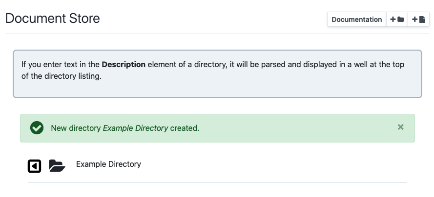
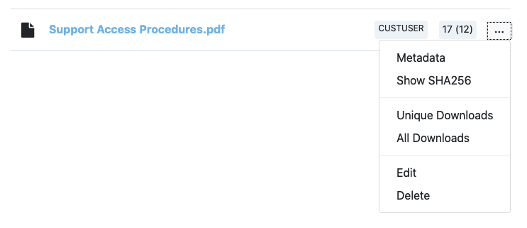

# Document Store

???+ note "**This page refers to features introduced in IXP Manager v5.4**"

**IXP Manager** has a *document store* allowing administrators to upload documents to be made available for specific [user classes](../usage/users.md#types-of-users) (public, customer user, customer admin, superadmin). The document store supports:

1. Uploading of any file type.
2. Editing uploaded files including name, description, minimum access privilege and replacing the file.
3. For non-public documents, logging and reporting of downloads.
4. Display of `.txt` and display and parsing of `.md` files within IXP Manager.
5. Directory hierarchy allowing the categorization of files (and per-directory explanatory text).
6. Deletion of files and directories.
7. Logging of destructive actions.

Please note that all actions except for viewing and downloading files are restricted to super users.

## Directories

Directories are database entries to which uploaded files are attached (rather than actual directories on the storage media).

Directories can be created via the *Create Directory* button on the top right of the document store. See the following image showing the *Create Directory* form with the contextual help shown (via the green *Help* button).

Note that you do not need to set any permissions on directories - directories (and directory hierarchy) will only be visible to specific user classes if they contain files that those user classes should be able to see.

If you enter a description, you will see a well element at the top of the directory as shown in the following image. The text you enter will be parsed as Markdown and displayed as the appropriate HTML. If you leave the description blank, no well element will be shown. This is a useful feature to provide context to your users about the documents in a given directory.

When a directory is created, there will be a context dropdown menu in the listing where the directory appears (i.e. in the directory's parent directory) with the following two options:

1. **Edit:** allows you to edit a directory's name, location (parent directory) and / or the description.
2. **Delete:** this removes the directory and **recursively deletes all files and folders within that directory**.

## Files

Files can be uploaded via the *Upload File* button on the top right of the document store. See the following image showing the *Upload File* form with the contextual help shown (via the green *Help* button).

While the various fields are well explained by the contextual help above, we will add some emphasis here:

* You should use an appropriate name with file extension as the download file will be given this value.
* Minimum privilege is just that - **minimum**. If a document is set for public access then **anyone can download it**. If it is set to *Customer User* then one **must** be logged into IXP Manager to see the file in directory listings and to view / download it. If it is set to *Customer User* then *Customer Admins* and *Super Users* will of course also be able to view it.

The following is how a file appears in a directory listing:

*CUSTUSER* indicates the minimum access permissions for the file. The numbers *17 (12)* tell use that there have been a total of 17 downloads and 12 of those were unique to existing users in IXP Manager. Note that **only downloads by logged in users are counted**. Publicly accessible files downloaded by non-logged in users are not recorded (if you must know this then that information is available from your web server log files).

The options in the per-file context menu are:

* **Metadata:** shows information such as file size and location on the storage media in a pop-up dialog.
* **Show SHA256:** show the file's sha256 checksum in a pop-up dialog.
* **Unique** and **All Downloads:** show the download logs for this file which contain the date and time of download and the username.
* **Edit:** edit the file.
* **Delete:** deletes the file.

If you wish to purge the download logs for a file, you will find a *Purge all download logs and reset download statistics* checkbox on the file edit form. You can check this without making any changes ti purge the logs.

### SHA256 Functionality

SHA checksums can be used to verify the authenticity / integrity of downloaded files. The primary use-case when developing the *Document Store* at INEX was for official documents from the INEX Board of Directors which they wished to share with the membership - for example minutes of board meetings.

The INEX Board Secretary would provide the PDF documents to the operations team for upload. In parallel the Secretary would also email the members' mailing list to inform them that a new set of minutes are being uploaded and the secretary would include the sha256 checksum in that email. This is a useful way to independently verify the authenticity of official documents and the reason this feature exists.

When uploading (or changing an uploaded file), if you enter a sha256 checksum, it will be verified on upload (and rejected if it does not match). If you leave it blank, the sha256 checksum will be calculated by IXP Manager.

## Limitations

The best way to view the limitations described herein is to understand that the development goals of the *document store* were to create something which is simple and secure while consciously avoiding a recreation of Dropbox. We discussed tens of features, dials and knobs for the document store but **chose to not implement them**.

1. **No backup / restore / undelete:** if you delete a file (or directory) in the web user interface then you will also delete the file as it is stored on disk. This is not a soft-delete option and it does not include a Dropbox-esque *undelete for 90 days*. If you select and then confirm the deletion of a file or directory, then we assume you have made a deliberate and conscious decision to do just that.

    It should be noted that while IXP Manager does not provide this kind of functionality - it also cannot reliably provide it. As a self-hosted application, it is up to the local system administrators to ensure adequate file system and database backups are in place.

    Then, with adequate local backup procedures and the developers expectations that a copy of important documents would also be kept off IXP Manager's document store, restoration of deleted documents is possible.

2. dd
1. If I do 'x' then we'll lose the logs:
