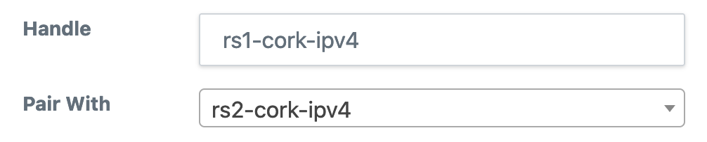

# Routers

IXP Manager can generate router configuration for typical IXP services such as:

* [route collectors](route-collectors.md);
* [route servers](route-servers.md) (with [IRRDB filtering](irrdb.md)); and
* [AS112 services](as112.md).

See the above pages for specific information on each of those use cases and below for instructions on how to generate configuration.

???+ tip
    For larger router configurations - especially when you have members with large prefix lists, you will need to [increase PHP's `memory_limit`](https://www.php.net/manual/en/ini.core.php#ini.memory-limit) as the default of 128M will not be sufficient. Start with 512MB and watch the log (`storage/logs/...`) which reports the memory and time for configuration generation.


## Managing Routers

The basic elements of *a router* are configured in **IXP Manager** under the *IXP Admin Actions - Routers* option on the left hand menu.

When you goto add / edit a router, the green help button will provide explanatory details on each field of information required:


From the router management page, you can:

* add / edit / delete a router;
* view all the details of a router;
* generate and view a router's configuration.

## Configuration Generation Overview

The simplest configuration to generate is the route collector configuration. A route collector is an IXP router which serves only to *accept all routes and export no routes*. It is used for problem diagnosis, to aid customer monitoring and for looking glasses (see [INEX's here](https://www.inex.ie/ixp/lg/rc1-lan1-ipv4)).

The [original Bird v1 configuration](https://github.com/inex/IXP-Manager/blob/main/resources/views/api/v4/router/collector/bird/standard.foil.php) simply pulls in a fairly standard header (sets up router ID, listening address and some filters) and creates a session for all customer routers on the given VLAN. The [new Bird v2 configuration](https://github.com/inex/IXP-Manager/blob/main/resources/views/api/v4/router/collector/bird2/standard.foil.php) has more features and replicates the route server filtering mechanism but tags and accepts all routes for diagnosis.

When adding a router, you give it a *handle*. For example: `rc1-lan1-ipv4` which, for INEX, would mean a route collector on peering LAN1 using IPv4. Then - for the given router handle - the configuration can be generated and pulled using the API as follows:

```sh
#! /bin/sh

# The API Key.
# This is generated in IXP Manager via the top right menu: *My Account -> API Keys*
KEY="your-admin-ixp-manager-api-key"

# The base URL of your IXP Manager install plus: 'api/v4/router/gen-config'
URL="https://ixp.example.com/api/v4/router/gen-config"

# The handle is as described above:
HANDLE="rc1-lan1-ipv4"

# Then the configuration can be pulled as follows:
curl --fail -s -H "X-IXP-Manager-API-Key: ${KEY}" ${URL}/${HANDLE} >${HANDLE}.conf
```

Configurations for the route server and AS112 templates can be configured just as easily.

 The stock templates for both are secure and well tested and can be used by setting the `template` element of the router to one of the following. **NB:** from May 2019, we recommend you use IXP Manager v5 and Bird2 templates.

* AS112:
    * `'api/v4/router/as112/bird/standard'`
    * `'api/v4/router/as112/bird2/standard'`
* Route Collector:
    * `'api/v4/router/collector/bird/standard'`
    * `'api/v4/router/collector/bird2/standard'`
* Route Server:
    * `'api/v4/router/server/bird/standard'`
    * `'api/v4/router/server/bird2/standard'`

We also provide sample scripts for automating the re-configuration of these services by cron:

* AS112 scripts [can be found here](https://github.com/inex/IXP-Manager/tree/main/tools/runtime/as112).
* Route collector scripts [can be found here](https://github.com/inex/IXP-Manager/tree/main/tools/runtime/route-collectors).
* Route server scripts [in this directory](https://github.com/inex/IXP-Manager/tree/main/tools/runtime/route-servers). These are quite robust and have been in production for ~10 years at INEX (as of May 2024).

All of these scripts have been written defensively such that if there is any issue getting the configuring or validating the configuration then the running router instance should be unaffected. This has worked in practice at INEX when IXP Manager was under maintenance, when there were management connectivity issues and when there were database issues. They also use the *updated API* (see below) to mark when the router configuration update script ran successfully.

## Router Pairing and Locking 

???+ info
    There is also a tutorial video [available on YouTube here](https://youtu.be/k12TzsNQwLI).

For IXPs, route servers are considered a critical production service and most IXPs deploy them in redundant pairs. This is usually implemented with dedicated hardware (servers with dual PSU, hardware RAID, and out-of-band management access) deployed in different points of presence.

When it comes to updating the configuration of these, the older scripts provided by IXP Manager suggested that this be done about four times per day with the timing of the cronjob set so that there is an offset so that each server will not update at the same time. The hope was that if there was an issue, only one server of the resilient pair would be affected, and engineers would have time to react and prevent updates on the other working server. Some IXPs added additional logic to the scripts to check if the other server was functional before performing a reconfiguration, but this was often limited to pings and a simple check to see if Bird was running.

The v6.4.0 release introduced a significant new resilience mechanism by pairing servers. In the IXP Manager router UI, you can now select another router to pair with the one you are editing: 




You would select pairs as follows:

* For route servers deployed in pairs, rs1-ipv4 should be paired with rs2-ipv4 and vice versa - be sure to set the paired server in each individual server.
* For route collectors, quarantine route collectors and AS112 services where you would normally have a single instance, you can pair the ipv4 version with the ipv6 version, ensuring at least one will always be running. For example, pair rc1-ipv4 with rc1-ipv6 and vice versa.

Once your pairs are set up, you need to deploy the new router update scripts as follows:

* for route servers: [tools/runtime/route-servers/api-reconfigure-example-birdv2.sh](https://github.com/inex/IXP-Manager/blob/release-v6/tools/runtime/route-servers/api-reconfigure-example-birdv2.sh)
* for route collectors: [tools/runtime/route-collectors/reconfigure-rc-bird2.sh](https://github.com/inex/IXP-Manager/blob/release-v6/tools/runtime/route-collectors/reconfigure-rc-bird2.sh)

*There is no need to use different scripts for route collectors and servers. Traditionally, at INEX, these scripts were developed slightly differently from each other (e.g., the collector script updates both IPv4 and IPv6 versions and provides more informative output, whereas the route server script takes a specific route server handle to update). We may merge these in the future.*

You can use these scripts exactly as they are on an Ubuntu server changing only the configuration lines at the top:

```
APIKEY="your-api-key"
URLROOT="https://ixp.example.com"
BIRDBIN="/usr/sbin/bird"
```

The collector script takes an additional configuration option for the handles of the servers to update - e.g.:

```
HANDLES="rc1-ipv4 rc1-ipv6"
```

These new scripts now work as follows:

1. **NEW:** Obtain a local script lock preventing more than one update script to execute at a time on the server (e.g., if the update is long-running, cron cannot start additional updates).
2. **NEW:** Obtain a configuration lock from IXP Manager.
    * This involves making an API call to `/api/v4/router/get-update-lock/$handle`, which IXP Manager then processes and returns HTTP code 200 if the lock is acquired and the update can proceed.
    * A lock is not granted if the router is paused for updates within IXP Manager (new per-router option in the router's dropdown menu on the router list page).
    * A lock is not granted if another process has already acquired a configuration lock for this router.
    * A lock is also not granted if the router's partner is locked. ***This major new resiliency addition prevents two paired route servers from being updated in parallel.***
    * The update script will abort if IXP Manager is unavailable or in maintenance mode. *It must get a HTTP 200 to proceed.*
3. If a lock is acquired, the script will then download the latest configuration from IXP Manager.
4. The script will do some basic sanity checks on the downloaded configuration:
    * First, check that the HTTP request to pull the new configuration succeeded.
    * Second, check that the downloaded file exists and is non-zero in size.
    * Third, ensure at least two BGP protocol definitions are in the configuration file.
    * Lastly, the script has Bird parse the downloaded file to ensure validity.
5. **NEW:** The update script will now compare the newly downloaded script to the running configuration.
    * If there are differences, the old configuration is backed up, and the Bird daemon will be reloaded.
    * If no differences exist, the Bird daemon will not be reloaded.
6. A check is performed to ensure the Bird daemon is actually running and, if not, it is started.
7. **IMPROVED:** A final API call is made to IXP Manager via `/api/v4/router/updated/$handle` to release the lock and update the *last updated* timestamp.
    * A significant improvement here is the use of a until api-succeeds, sleep 60, retry construct to ensure the lock is released even when there are transitive network issues / IXP Manager maintenance modes / server maintenance, etc.

Adding step (5) above (only reload on changes) now allows the update script to be safely run as frequently as every few minutes, which is necessary for the UI-based community filtering to be effective.

*You should still offset the updates between router pairs, as the script will give up if a lock cannot be obtained. Future improvements could allow for some retries.*

For additional information with UI images, see slides 25-30 in [this presentation PDF](https://www.barryodonovan.com/wp-content/uploads/2024/03/euroix-rs-workshop-2024-03-13.pdf).


## Updated API

It can be useful to know that the scripts for updating the router configuration for AS112, route collector and route server BGP daemons run successfully. At INEX for example, we have three LANs and so 10 individual servers running a total of 30 Bird instances which is unwieldy to check and monitor manually.

When viewing routers in IXP Manager, you may have noticed the *Last Updated* column which will initially show *(unknown)*. All our update scripts (see above) trigger the updated API call when a route configuration run has completed successfully. Note that this does not mean that a configuration has necessarily changed but rather that the update script ran and executed correctly. In other words: *the configuration was successfully pulled from IXP Manager, compared to the running configuration and, if changed, successfully applied*.

The API call to update the *last updated* field to *now* is a POST as follows:

```
curl -s -X POST -H "X-IXP-Manager-API-Key: my-ixp-manager-api-key" \
    https://ixp.example.com/api/v4/router/updated/{handle}
```

where `{handle}` should be replaced with the route handle as described above.

The result is a JSON object with the datetime as set and is equivalent to the result of the following API call which fetches the *last updated* field without setting it:

```
curl -s -X GET -H "X-IXP-Manager-API-Key: my-ixp-manager-api-key" \
    https://ixp.example.com/api/v4/router/updated/{handle}

{"last_updated":"2017-05-21T19:14:43+00:00","last_updated_unix":1495394083}
```

There are two useful additional API endpoints. To get the last updated time of **all** routers, use:

```
curl -s -X GET -H "X-IXP-Manager-API-Key: my-ixp-manager-api-key" \
    https://ixp.example.com/api/v4/router/updated

{"handle1":{"last_updated":"2017-05-21T19:14:43+00:00","last_updated_unix":1495394083},
 "handle2":{"last_updated":null,"last_updated_unix":null},
 ...}
```

The above output shows the format of the reply as well as the fact that routers without a last updated value set will be included as null values.

Lastly, you can request the last updated time of routers where that time exceeds a given number of seconds. *In this call, routers without a last updated time will not be returned.* This is useful for monitoring applications such as Nagios where you would want a warning / alert on any routers that have not updated in the last day for example:

```
curl -s -X GET -H "X-IXP-Manager-API-Key: my-ixp-manager-api-key" \
    https://ixp.example.com/api/v4/router/updated-before/86400

[]
```

This example also shows that an empty JSON object is returned for an empty result. Otherwise the format of the reply is the same as for the call above for all routers:

```
{"handle1":{"last_updated":"2017-05-21T19:14:43+00:00","last_updated_unix":1495394083},...}
```

## Examples

We use [Travis CI](../dev/ci.md) to test IXP Manager before pushing new releases. The primary purpose of this is to ensure that the configuration for routers generated matches known good configurations from the same sample database.

These known good configurations also serve as useful examples of what the standard IXP Manager configuration generates.

See [these known good configurations here](https://github.com/inex/IXP-Manager/tree/main/data/ci/known-good) and:

* `as112`: AS112 router configurations conforming to [rfc7534](https://tools.ietf.org/html/rfc7534) (AS112 Nameserver Operations) and implementing [rfc7535](https://tools.ietf.org/html/rfc7535) (AS112 Redirection Using DNAME). There are configs to serve queries over both IPv4 and IPv6. See [the AS112 documentation for more details](as112.md).
* `rc1`: route collector configurations. Peering with the route collector is mandatory at many IXPs including INEX. These are incredibly useful for monitoring, diagnosing issues and providing looking glasses. We also use the quarantine version of these for turning up new member connections.
* `rs1`: route collector configurations. See below for full details of what these implement. See [the route servers documentation for more details](route-servers.md).


## Live Status

The live status of any configured routers that have API access can be seen in **IXP Manager** via the *Live Status* sub-menu option of *Routers* on the left hand side menu.

Each router is queried twice via AJAX requests to provide:

* BGP daemon version
* API version
* configured BGP sessions
* established BGP sessions
* last updated time
* last reboot time


## Filtering Known Transit Networks

We filter known transit networks as discussed here: [https://bgpfilterguide.nlnog.net/guides/no_transit_leaks/](https://bgpfilterguide.nlnog.net/guides/no_transit_leaks/).

There are three configuration options available to allow you to change the default behaviour. These options exist to provide an easier path than skinning the template files directly.

Exclude one of more AS numbers from the default list (see [this file](https://github.com/inex/IXP-Manager/blob/main/resources/views/api/v4/router/server/bird2/filter-transit-networks.foil.php) on your own deployment of IXP Manager).

**(1) Exclude Specific ASNs:**

If you just want to exclude one or more ASNs from the default list, then using comma separation, set the following in your `.env` file:

```
IXP_NO_TRANSIT_ASNS_EXCLUDE=65501,65502
```

**(2) Disable This Feature Entirely:**

Set an empty configuration option as follows in your `.env` file:

```
IXP_NO_TRANSIT_ASNS_OVERRIDE=
```

**(3) Use Your Own Custom List of ASNs:**

Set the following configuration option with a comma separated list as follows in your `.env` file:

```
IXP_NO_TRANSIT_ASNS_OVERRIDE=65501,65502,65503
```
