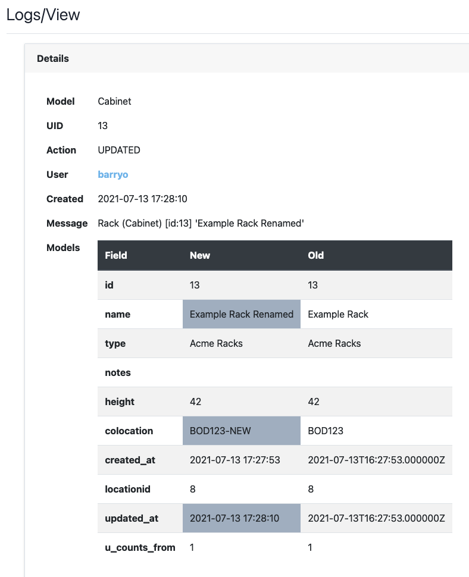

# Database Change Logging

In IXP Manager v6, we changed the database access layer to Laravel's Eloquent. As part of this work, we added a new listener for any UI based changes to database objects.

You will find *[View logs]* buttons through IXP Manager and these will link to the appropriate entries in the *Logs* controller (which you can find in the left hand menu under *IXP UTILITIES*).

**NB:** logs are expunged after six months. We feel this is a useful compromise between: auditing changes; keeping the database from growing unnecessarily large; and data privacy (as logs include user and contact objects).

A sample of the logs list for a rack / cabinet:

As you can see, for the purposes of demonstration, I created, edited and then deleted a rack.

The creation log contains:

The edit log highlights the changes made:

The creation log contains:

And the deletion log retains the data:

