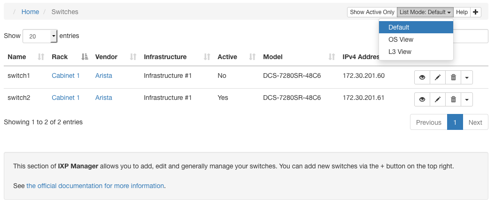

# Switches

The central element of an IXP is the switches. **IXP Manager** provides comprehensive management features for switches (and more complex configurations such as VXLAN overlay networks).

We strongly advise against trying to add and manage switches in IXP Manager without SNMP. SNMP v2 is a core element of how switches work within IXP Manager including accurate port discovery, graphing, port states, optic availability, etc.

## Listing Switches

You access the switch management functionality in IXP Manager via the *Switches* menu option under *IXP Admin Actions* in the left hand side control menu. The default action is to list the configured switches:



From the above screenshot, you will notice a number of features:

1. There is a toggle button *Show Active Only* which will toggle the list views to show all switches (default) or only active switches.
2. The default switch information view is shown. There are two additional list views under the top right *List Mode:* dropdown:
    * **OS View:** shows information (where available via SNMP) about the switch software, its version, the serial number, etc. This view is useful for planning software upgrades.
    * **L3 View:** when running your exchange using an overlay network such as VXLAN, this view shows the layer 3 details of your switches including AS number, loopback address, etc.
3. The *Help* button on the top right links to this documentation.
4. The *plus* icon on the top right is used to add new switches.

In the list view above, you will also notice that there are per row / per switch options on the right:


1. The *eye* (view) button shows the complete database record for a switch including all the SNMP discovered information from the *Iface* and *MAU* SNMP MIBs.
2. The *pencil* button allows you to edit a switch's details.
3. The *trashcan* button allows you to delete a switch. **NB:** a switch can only be deleted if there are no associated ports, patch panel connections, etc. Switches can alternatively be made inactive by editing it and unchecking the *Active* checkbox.
4. Under *SNMP Actions* there are two options and the resulting view is made from a live/immediate SNMP poll:
    * **View / Edit Ports:** Allows you to edit port type, port active status, etc. Please see documentation below for details.
    * **Live Port States:** Shows the current port states including: name, alias/description, LAG, speed / duplex, MTU, administrative and operational state.
5. Under *Database Actions* you can get information on the switches ports as recorded in the database (usually from the last time the switch was polled):
    * **View / Edit Ports:** Allows you to edit port type, port active status, etc. Please see documentation below for details. Where SNMP is available, the above SNMP version of this has more features and is preferred.
    * **Port MAU Detail:** MAU (Medium Attachment Units) - provides information on the XFP / SFP / etc. optics installed in a switch. If the option is disabled then it means the switch does not support the SNMP MAU MIB.
    * **Port Report:** a simple report listing who is connected to each port in a switch. E.g. useful as a hardcopy when going to a datacentre.

## Adding and Editing Switches

From the [list view described above](#listing-switches), click the *plus* button in the top right to add a switch. Switches are added by SNMP poll so the first step is to provide a hostname and SNMP v2 community:


The switch must respond to SNMP queries from the server on which IXP Manager is installed. This can be testing on the command line as follows:

```sh
root@ixpmanager:~# snmpget -c yourcommunity -v 2c switch01.mgmt.example.com .1.3.6.1.2.1.1.1.0
iso.3.6.1.2.1.1.1.0 = STRING: "Arista Networks EOS version 4.18.0F running on an Arista Networks DCS-7280SR-48C6"
```

After completing the details and clicking *Next >>*, IXP Manager will poll the switch and present you with the second (and last) stage in adding a switch:


The important things to note about this are:

1. Clicking the green *Help* button will show individual help / instructions for each field.
2. The hostname and SNMP community are read only here as they were entered in the previous step and the additional details pre-filled were discovered by a SNMP poll.
3. The name of the switch is how you want it shown in various sections of IXP Manager. We recommend using the hostname of the fully-qualified-domain-name of the switch. Regardless of what you use, please do not use periods, spaces or non-alphanumeric characters besides dashes and underscores.
4. The vendor and model are prefilled where IXP Manager could successfully identify them based on [platform discovery - see below](#platform-discovery). If the vendor does not exist in the dropdown, it can be added via the *Vendors* option in the left-hand menu.
5. The elements under *Management Configuration* are not used directly by IXP Manager but can be used for orchestration and automated provisioning (as it used by INEX - [see here](https://github.com/inex/ixp-manager-provisioning)).
6. The elements under *Layer 3 Configuration* are not used directly by IXP Manager but can be used for orchestration and automated provisioning of overlay networks such as VXLAN (as it used by INEX - [see here](https://github.com/inex/ixp-manager-provisioning)).


### Platform Discovery

The discovery of a switches vendor, model, operating system details and serial number - as well as MAU details - is achieved via a third party package called [OSS_SNMP](https://github.com/opensolutions/OSS_SNMP). While this shares an author in common with IXP Manager, it is a separate project.

If your switch is not discovered automatically, you can open a ticket [with the OSS_SNMP project **directly**](https://github.com/opensolutions/OSS_SNMP/issues) and ensure you [provide the details requested here](https://github.com/opensolutions/OSS_SNMP/wiki/Device-Discovery#adding-new-devices).

## Managing Switch Ports

Recall the per row / per switch options on the right hand side of each switch's row when listing switches:


These options allow you to list and manage switch ports. Of these, the most relevant is the *View / Edit Ports* under *SNMP Actions* which leads to a page as follows:


The page allows you to:

* Change the port type dynamically via AJAX on a per port basis (the column of *Unset / Unknown* dropdowns).
* Select a group of ports (and optionally invert the selection via the *square refresh* icon) or select all ports. Then, with the selected ports:
    * delete them
    * change their type
    * set them as active / inactive

Note that deleting ports is not a permanent action if the port physically exists and is discovered in a subsequent SNMP poll.

### Switch Port Types

While some of these are clear from the name, we will explain each type here for completeness:

* **Unset / Unknown:** no type has been set. A port is automatically set to **Peering** or **Core** when it is assigned to a customer / core bundle.
* **Peering:** peering port assigned to a customer. Automatically set when the port is assigned to a customer.
* **Monitor:** a port used for monitoring / mirroring traffic from another port. These ports are used by INEX when provisioning a new customer during what we call our *quarantine process*. This allows us to ensure the customer end is configured correctly without discovery protocols (CDP, LLDP, etc.), keepalives, no unexpected tagged packets, etc.
* **Core:** a core / inter-switch link port. This is automatically set when a port is added to a core bundle.
* **Other:** a purpose other than what we have provided options for.
* **Management:** management access to a switch.
* **Fanout** and **Reseller**: used for [reseller functionality](../features/reseller.md).

## Automated Polling / SNMP Updates

Switch and switch port information in the database can go stale very quickly. As such, IXP Manager will poll switches using SNMP every five minutes via the [task scheduler](../features/cronjobs.md). You can do it manually via the Artisan command:

```
/srv/ixpmanager/artisan switch:snmp-poll
```

The command signature is:

```
switch:snmp-poll [--log] [--noflush] [-q, --quiet] [<switch>]
```

where:

* `[-q, --quiet]` does not output anything unless there is an error. Should be used for cron jobs.
* `[--log]` outputs detailed SNMP polling information to `/srv/ixpmanager/storage/logs/laravel.log`. You can tail this file when running it to help diagnose any issues.
* `[--noflush]` polls the switch but does not write anything to the database.
* `[<switch>]` allows you to optionally limit the polling to a single named switch (the switch's name, not hostname). If not specified, all pollable switches are polled.

Not that inactive switches are not polled unless an inactive switch name is explicitly specified.

Similarly, any switch that is not set to poll (*Poll* checkbox with adding / editing a switch) will be skipped unless explicitly specified.


### Matching Database Ports to Switch Ports

When we poll the switch to update the database, we need a method to match ports in the database with those on the switch so we can update, remove and add ports. This is achieved using the `ifIndex` as reported by SNMP.

*We have tried other methods in the past including `ifName` but there is no perfect solution to this as switch operating system updates can cause any of these data points to change. In the end we settled on `ifIndex`.*

If you find that a switch update had caused the `ifIndex` to change, then you can reindex the database by updating the `ifIndex` based on the `ifName` using the `switch:reindex-ifindex` Artisan command.

To perform a test run and see what would change, execute it per the following example:

```
$ ./artisan switch:reindex-ifindex swi2-nwb1-3 --noflush
 - swp1 unchanged, ifIndex remains the same
 ...
 - bond2 unchanged, ifIndex remains the same
 - bond3 ifIndex changed from 10056 to 10178
 ...
 - mgmt unchanged, ifIndex remains the same

*** --noflush parameter set - NO CHANGES MADE TO DATABASE
```

If you are comfortable with the changes proposed, rerun it

**Operational Note:** if performing switch operating system updates that are known to change the `ifIndex`, it is strongly advised to disable polling (*Poll* checkbox when adding / editing a switch) for the duration of the upgrade work and until after you have reindexed the ports.


### SNMP and Port Types (`ifType`)

By default, IXP Manager restricts the type of port to ifType `ethernetCsmacd`, `l2vlan` and `l3ipvlan`, because most network operating systems include various types of virtual port which are not relevant to IXP operation. Sometimes, some vendors (e.g. Juniper) use a richer set of ports, and a wider selection of ifTypes. If these ifTypes were enabled in the general case, IXP Manager operators would be presented with lots of port types that were irrelevant to their IXP service.

This is a traditional user interface situation: we need a balance between hiding the inherent complexity of what's going on, while enabling enough flexibility to allow the operator to do what they need, while ensuring that the underlying code base and config is maintainable as a long term proposition.

If you examine the file `config/ixp.php` you'll find an element called `snmp['allowed_interface_types']`. The default behaviour is equivalent to creating a `.env` setting as follows:

```
IXP_SNMP_ALLOWED_INTERFACE_TYPES="6,135,136"
```

where 6, 135 and 136 are the SNMP codes for ifType `ethernetCsmacd`, `l2vlan` and `l3ipvlan` respectivily. *Note that over time we may add more to the default stack - the configuration file will always represent the default status.*

If you wish to have IXP Manager poll additional interface / port types on your switch then set this .env variable. For example, to additionally allow irb interfaces on Juniper (which at time of writing use `ifOther`) then set it as follows:

```
IXP_SNMP_ALLOWED_INTERFACE_TYPES="1,6,135,136"
```

More detail may be found in the [originating GitHub issue #695](https://github.com/inex/IXP-Manager/issues/695)).

## Migrating Customers to a New Switch

When moving IXP customers from one switch to another, add the new switch into the IXP Manager as described above. The customer port assignments can easily be changed to the new switch using the IXP Manager web interface. It is advisable not to delete the old port assignment and create a new one, because if this happens, then the old customer port graphs will not be preserved.

The process is, for each customer:

* find the customer's overview page on IXP Manager (chose customer from top right dropdown)
* find and edit the relevant port under the *Ports*
* edit the physical interface of each port being moved
* chose the new switch and switch port
* save the changes

When the switch port updates have been completed, it's advisable to rebuild the mrtg configuration using the CLI tool and (if using dynamically discovered MAC addresses) also to update the layer 2 database, otherwise some MRTG and sflow stats may be lost.


## Related Tools

### Port Audit

**IXP Manager** administrators can audit port speeds as configured in [physical interfaces](interfaces.md#physical-interface-settings) against what has been discovered in the last SNMP run.

You can run it from Artisan such as the following example:

```
./artisan audit:port-speeds

Audit of Configured Physical Interface Port Speeds Against SNMP Discovered Speeds

+------------------------------+----------+----------------+-----------------------+----------+------------+
| Customer                     | PI DB ID | Switch         | Switchport            | PI Speed | SNMP Speed |
+------------------------------+----------+----------------+-----------------------+----------+------------+
| INEX Route Servers [AS43760] | 14       | swi2-tcy1-2    | GigabitEthernet27     | 0        | 1000       |
| INEX [AS2128]                | 15       | swi1-ix1-2     | X460-48t Port 47      | 0        | 1000       |
| INEX [AS2128]                | 16       | swi2-ix1-1     | GigabitEthernet25     | 0        | 1000       |
| AS112 Reverse DNS [AS112]    | 21       | swi2-nwb1-1    | X670G2-48x-4q Port 15 | 0        | 1000       |
| INEX [AS2128]                | 357      | swic-cix-2     | GigabitEthernet27     | 100      | 1000       |
| AS112 Reverse DNS [AS112]    | 590      | swt-cwt1-edge1 | swp3                  | 10000    | 1000       |
+------------------------------+----------+----------------+-----------------------+----------+------------+
```

The above examples are edge cases as they are not physically connected devices but rather virtual machines. This audit can be added to cron such that it will only make noise if an issue is found with something like:

```
13 9 * * *   www-data     /srv/ixpmanager/artisan audit:port-speeds \
                            --cron --ignore-pids 14,15,16,21,357,590
```
