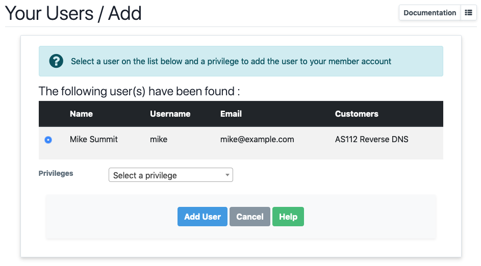

# Users

???+ note "**This page refers to IXP Manager >= v5.0**"
    User management prior to v5.0 was handled differently - please see [this page](legacy/users.md) for the legacy usage.

The IXP Manager Users feature allows you to add and manage users (people who can login to IXP Manager) on a per customer basis including:

* name / email / phone number
* username
* permissions (see below)

## Types of Users

There are three types of user:

* **Customer User** - a standard customer user with **read only** portal access to a specific customer's dashboard.
* **Customer Administrator** - a customer administrative user. This account allows users to make changes as well as manage users for their organisation.
* **Superuser** - IXP staff only. **FULL ACCESS TO ALL CUSTOMERS AND FUNCTIONS**. This is only for your IXP staff!

## Managing Users

If you are a Superuser, you can manage users in one of two ways:

1. Via the user controller by clicking on *Users* under **IXP CUSTOMER ACTIONS** in the left hand menu. This will show all users on the system.
2. For a per customer view, you can click on the *Users* tab in the standard customer overview page.

If you are a customer administrator user, you can manage your own users via the *Users* menu in the top menu bar. In all cases, you will be given a list of users such as:

The available actions include:

* a documentation link on the top right - that links to this page;
* to add a new user, click on the *[+]* button next to the documentation link;
* the view (eye) icon will show you more information about a specific user;
* the edit (pencil) icon will allow you to edit users;
* the delete (trashcan) icon will allow you to delete a user.

### Adding Users

Since a user can be associated with multiple customers, the new user you wish to add may already exist on the system. For this reason, the first step of adding a user is to just provide and email address:

If the user does not exist, you will be invited to complete the rest of the standard details:

Note that, as always, the *[Help]* button will provide context help for each input field. Once you successfully complete the details, the new user will be sent a welcome email ([see below for details](#welcome-email)) and invited to set their password.

If any users do exist with this email, you will be shown the user's name, username (and, if a superadmin, the other customer(s) the user is associated with). Note that it is possible for an email to be associated with more than one username but this should only happen for legacy users that predate the ability to assign a user to more than one customer.

Select the user you wish to add to the customer and set the desired privilege and click *[Add User]*. The new user will be sent a specific welcome email for users that already exist on the system to let them know they have been added to a new customer account ([see below for details](#welcome-email)).

### Deleting Users

Note that *deleting* a user results in one of two actions:

1. if the user is only linked to a single customer (probably the most likely case), the user will be fully deleted and removed from the system.
2. if the user is linked to more than one customer, then only the link to this customer will be removed.

## Users With Multiple Customers

This section explains the handling around users with multiple customers.

When logging in, the last customer that the user acted for will be selected. If this customer does not exist / the relationship no longer exists / no previous customer set then a customer will be chosen at random.

If a user is associated with more than one customer, then the facility to switch users can be found under the *My Account* menu on the top right:

The current customer is highlighted.

## Welcome Email

**IXP Manager** sends a welcome email to all newly created users.

The default template for **new users** this can be found at `resources/views/user/emails/welcome.blade.php`. When an existing user is associated with an additional customer, the following template is used: `resources/views/user/emails/welcome-existing.blade.php`.

If you wish to change these templates, you can do so via the [standard skinning mechanism](../features/skinning.md).

## Logging in as Another User

Administrative users (*AUTH_SUPERUSER*) can *switch to* other users to *see what they see* via the user list or the customer overview page.

The purpose of this is for both development and for support staff to replicate issues as reported by users.

## Planned Work

As IXP Manager v5 evolves, we would like to make a number of changes:

* look at OAuth2 with links to PeeringDB as well as allowing people to log in / link OAuth supported social media accounts;
* add 2fa.

## Passwords and Password Hashing

**As of v4.5, all passwords are stored as bcrypt with a cost >=10.**

As of v4.9, administrative users are unable to set a user's password. User's can set (and reset) their passwords via their *Profile* page or using the password reset functionality.
